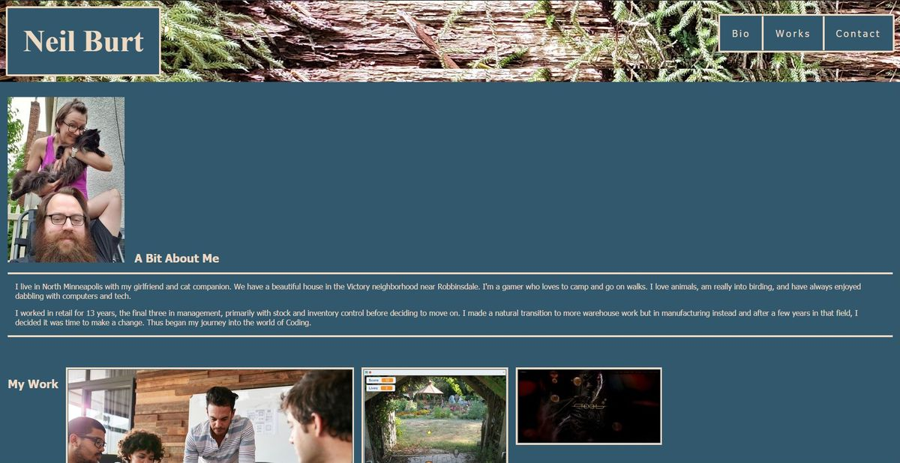
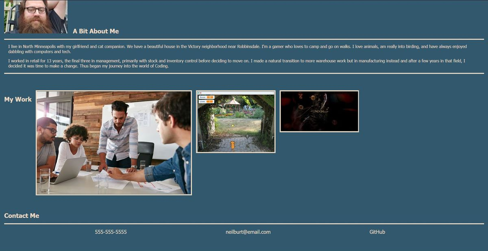

# Homework 2 - Portfolio
## Description
This is a personal profile web page to let an employer know a little about me, display my work so far, demonstrate the advanced CSS techniques that I have learned, and provide my contact information.

The Tool band website is not my work, it is merely a placeholder as I do not have a lot of work of my own yet. They happen to be my favorite band and have an inspiring web design.

The phone number and email are fake but the GitHub link does lead to my GitHub profile.

## Screenshots

---

Check out the [deployed web page](https://neilburt.github.io/portfolio/).